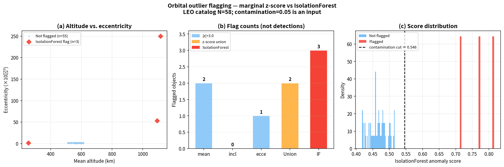
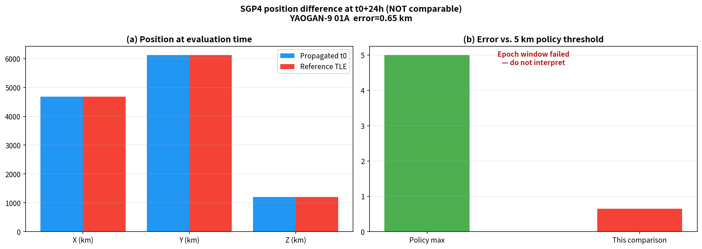
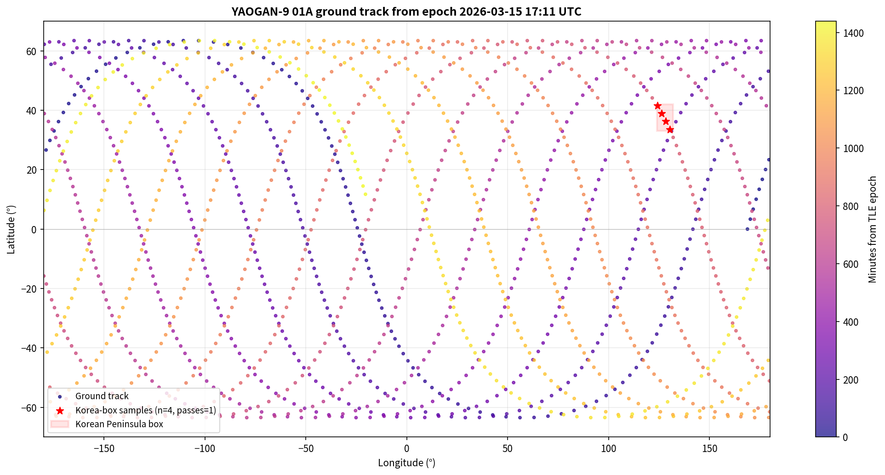

# SDA Heterogeneous Data Fusion, Toolkit

*Presented at Yonsei Aerospace Week 2026 (May 2026), Excellence Award. Rewritten and audited in August 2026 before publishing to GitHub. Read this whole README before citing any number from this project.*

A 3-layer (TLE, EO, RF) data fusion toolkit for Space Domain Awareness (SDA): flag anomalous orbits from TLE data, physically follow up on one flagged candidate, check optical observability, and demonstrate ingesting a third independent EO data source.

## Read this first: the symposium headline numbers are not verified

The version of this code that produced the numbers presented at the symposium (**695 candidates (5.0%), 0.20km SGP4 deviation, 4.1%/8.1%/11.4% OWL-Net visibility**) was audited after presenting. Full audit: [`VALIDATION_REVIEW.md`](VALIDATION_REVIEW.md). The audit found the original scripts ran, but not as documented:

- One of three "OWL-Net Korea" stations was actually **Mt. Lemmon, Arizona, USA**, plotted with invented coordinates near Busan. A second listed station (Sobaeksan) is not an OWL-Net site at all. The real Korea-based OWL-Net has **two** sites (Bohyun, Daedeok).
- "Astronomical night" used sun-altitude < -10° instead of the correct < -18°.
- The "t24" TLE was whatever Celestrak's *current* catalog returned when the script ran, not verified to actually be about 24h after t0. A rerun today would compare t0 against a TLE that could be days or weeks away and silently call it a 24h validation.
- The "+RF" and "Multi-Source Fusion" visibility figures were `optical_average × 2.0` and `× 2.8`, invented multipliers, not RF measurements. (This was already flagged in the previous version of this repo. The fix here is that the multipliers are now deleted, not just labeled.)
- Landsat NDVI was computed on raw Collection-2 surface-reflectance integers without applying the required scale (0.0000275) and offset (-0.2), not the calibrated reflectance values the formula assumes.
- `IsolationForest(contamination=0.05)` **sets** its own flagging rate by construction. "695 (5.0%)" is closer to reading back a parameter than reporting a discovery.
- The ground-track "n passes over Korea" counted 5-minute *samples* inside a lat/lon box, not discrete passes. A single 15-minute pass could count as 3.
- The NDVI figure title still said "Cross-validation of TLE Anomaly Detection" after that framing had already been withdrawn elsewhere.

None of this means the underlying research idea is wrong. TLE-based outlier flagging, SGP4 follow-up, and optical-visibility geometry are all legitimate techniques. It means **the specific numbers above rest on a specific catalog pull and a specific incorrect station table, and can't be reproduced or defended as stated.** The fix wasn't to patch the numbers. It was to rewrite the toolkit so it structurally can't make these mistakes again, and to test that.

## What's in this repo now

- **`sda_fusion/`**: a tested Python package (not standalone scripts). TLE parsing with checksum validation, orbital elements, anomaly flagging, epoch-gated SGP4 comparison, real OWL-Net station data, ground-track pass counting, and an EO/NDVI module with correct Landsat scaling and no `ee` leakage outside its own adapter.
- **`experiments/`**: one-command wrappers around the package, one per original figure.
- **`tests/`**: 15 tests, all passing, checking the specific things that were wrong before: TLE checksum, YAOGAN-9's known epoch/altitude, that the anomaly feature set excludes the redundant mean-motion column, that the SGP4 epoch window correctly rejects a week-old reference TLE, that Korea stations don't include Arizona, that the pass counter counts passes not samples, and that offline NDVI stays labeled synthetic.
- **`data/fixtures/`**: bundled TLEs (including YAOGAN-9's actual t0 line), so the toolkit runs without any network access.
- **`outputs/`**: a real, checked-in run of the full pipeline on the bundled 58-object demo catalog (not the original 13,893-object Celestrak pull, see below). Kept as evidence the pipeline actually runs end-to-end and behaves honestly, not as a replacement for the withdrawn headline numbers.

## What the demo run in `outputs/` actually shows

Run on `data/fixtures/demo_catalog.tle` (58 objects, a small bundled/synthetic fixture catalog for reproducible testing, not the real 13,893-satellite Celestrak pull):

- **Anomaly flagging:** 3 of 58 flagged (fusion), 2 of 58 by single-parameter z-score union. YAOGAN-9 01A is flagged (fusion score 0.77), alongside two synthetic test objects designed to be obvious outliers.
- **SGP4 case study:** the bundled reference TLE is about 174 hours (7.2 days) from t0, not 24. The pipeline correctly reports `comparable: false` and refuses to interpret the resulting 0.65km number as a maneuver test. This is the fix in action, not a new result.
- **Ground track:** 4 samples fall in the Korea bounding box, correctly counted as **1** actual pass (previously this distinction wasn't made).
- **EO demo:** offline mode uses a fixed synthetic placeholder (NDVI 0.42 → 0.18, Δ=-0.24) so the repo runs without live Earth Engine access. This is **not** a real Jinju measurement. A real corrected-NDVI run requires `--live --project YOUR_PROJECT` with GEE credentials, which hasn't been done with the fixed scale/offset logic yet.

Figures for all of the above are in `outputs/` and load directly in this README's linked sections below.





## Tech stack

Python, Skyfield, scikit-learn, pandas, NumPy, Matplotlib, Google Earth Engine (optional/live path only), pytest.

## How to run

```bash
pip install -r requirements.txt
python -m pytest tests -q
python -m sda_fusion.cli pipeline --catalog data/fixtures/demo_catalog.tle --out outputs --skip-visibility
```

Visibility (OWL-Net optical windows) needs Skyfield's DE421 ephemeris, downloaded automatically on first run. Omit `--skip-visibility` to include it. To run anomaly flagging against a real, current Celestrak catalog instead of the bundled fixture: `python -m sda_fusion.cli anomaly --catalog <path-to-downloaded-catalog>`.

## What's not in this repo

- **A verified reproduction of the 13,893-object / 695-candidate / 0.20km / 4.1-11.4% symposium numbers.** See above, they're not currently defensible, and this rewrite doesn't manufacture new versions of them.
- **SQLite storage pipeline and a direct NASA EarthData download attempt**: exploratory code from the original project, never part of the presented methodology, not included here either.
- **SatSim synthetic imagery + light-curve photometry** and **SDR-based Passive RF integration**: scoped as *future work* in the original research plan. No code for either exists.

## Limitations / what's next

- Full-scale validation (real ~13,893-object Celestrak catalog, a genuinely time-separated t0/t24 TLE pair, and a live GEE NDVI run with the corrected scale/offset) hasn't been re-run yet. That's the actual next step before this project can publish new headline numbers.
- `contamination=0.05` is still an assumption, not a fitted or cross-validated value. The rewrite labels this honestly in every output rather than fixing it, since fixing it needs labeled anomaly data that doesn't exist.
- See [`VALIDATION_REVIEW.md`](VALIDATION_REVIEW.md) section 9 ("Deferred, and when it becomes dangerous") for the full list of what's intentionally not fixed yet and why.

## Credits

Built independently. Presented at the 2026 Yonsei Aerospace Week Symposium, received an Excellence Award. The August 2026 audit and rewrite ([`VALIDATION_REVIEW.md`](VALIDATION_REVIEW.md), `sda_fusion/`, `tests/`) were done in collaboration with Claude (Anthropic). The audit is as much a part of this portfolio piece as the code.
